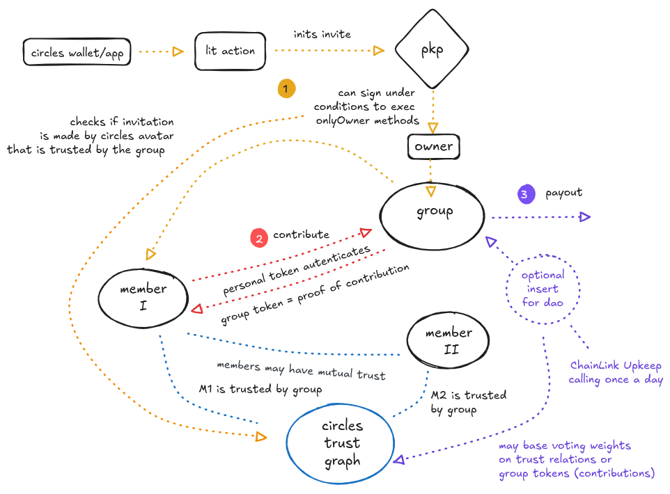

# TrustFund for EthDam2025 and Circles


### Visual overview of main functionalities



For many of the design choices covered in the presentation we can propose technical solutions: 

### Ownership

We want these invite only communities for collective saving schemes to be based on CirclesV2 groups in which all members are equal and there are no single entities in control of the group or its treasury. There are no special roles, no subsets of members that are more equal than others. It should be a completely flat organization.

Default CirclesV2 architecture has special owner and service roles that have exclusive power to invite new members

We can give each member these powers by minting a programmable key pair (PKP) on the LIT network and inserting its Ethereum address as the owner of newly deployed CirclesV2 group contracts. Now only the PKP can invite new members. 

We have programmed the PKP with conditions under which it will sign transactions. Gnosis addresses with a CirclesV2 human avatar that is trusted by the group will meet these conditions. All groups members can therefore invite other members using a Lit Action that performs calls the PKP to sign the invitation transaction. We have also programmed the PKP to only respond to requests from A LIT Action with a specific IPFS cid. The code to call the PKP cannot be tampered with.

Conditions: 

```
{
	conditionType: "evmContract",
	contractAddress: HUBv2_address,
	functionName: "isTrusted",
	functionParams: [groupAddress, candidate],
	functionAbi: abi,
	chain: "gnosis",
	returnValueTest: {
		key: "",
		comparator: "=",
		value: "true",
	}
}
```

[Mint PKP](protocol/scripts/pkp-mint.ts)
[Lit Action Code](lit/src/invite)
[Run action](lit/scripts/run-action.ts)

### Payment authorization

New members will have to authorize the group contract to transfer EURe/USD(e) from the user's wallet into the group treasury.

```
const EURe_ADDRESS = '0xcB444e90D8198415266c6a2724b7900fb12FC56E';
const ERC20_ABI = [
 'function approve(address spender, uint256 amount) external returns (bool)'
];

export const approveStablecoinTransfer = async (userAddress: string, contributionAmount: number) => {
	const usdc = new ethers.Contract(EURe_ADDRESS, ERC20_ABI, signer);
	// authorize monethly payments for duration of a year
	const allowance = ethers.parseUnits((12 * contributionAmount).toString(), 6);
	const tx = await usdc.approve(mintPolicyAddress, allowance)
	console.log('Transaction hash:', tx.hash);
	await tx.wait();
	console.log('Approval confirmed');
}
```

[View code](frontend/src/lib/factory/authorize_payments.ts)

### Additional membershipConditions

Optional: to emphasize that these groups are for people whom have existing trust relations, we could require candidate members to have human to human trust relations with other members in the group. To do so we added mapping and method on the custom group contract to view addresses that have been trusted and are still trusted. 

We could then add a membership condition that requires candidates to be trusted by at least 4 existing members. This applies when the member count is four or higher.

```
function passesMembershipCondition(address _avatar) external view returns (bool) {
	// Get sponsors from TFGroup's trusted avatars
	address[] memory sponsors = TFGroup(msg.sender).getTrustedAvatars();
	// Only apply this condition when there are at least 4 sponsors
	if (sponsors.length < 4) {
		return true; // Skip this condition if not enough sponsors
	}

	uint256 count = 0;
	for (uint256 i = 0; i < sponsors.length; i++) {
		if (hub.isTrusted(sponsors[i], _avatar)) {
			count++;
			if (count >= 4) return true;
		}
	}
	return false;
}
```

[View code](custom-contracts/sol/implementations/TrustedByFour.sol)

### Making the contribution

Frontend will call groupMint method on CirclesV2 hub contract. This should be automated with Chainlink Keeper or Gelato, to avoid a delay's because of user inaction. Payments will triggered for all group member at the same time.

```
const sdk = new Sdk(adapter, circlesConfig);
const avatar = await sdk.getAvatar(safeAddress);
// send one of your personal CRC to the group for authentication.
const collateralAvatars = [safeAddress];
const amounts = [BigInt(1)];

// Encode the contribution amount as bytes and convert to Uint8Array
const abiCoder = new AbiCoder();
const encodedData = abiCoder.encode(['uint256'], [contributionAmount]);
const data = new Uint8Array(Buffer.from(encodedData.slice(2), 'hex'));

try {
	const receipt = await avatar.groupMint(groupAddress, collateralAvatars, amounts, data);
	console.log('Minting successful:', receipt);
} catch (error) {
	console.error('Minting failed:', error);
}
```

[View code](frontend/src/lib/factory/groupMint.ts)

The group contract has been optimized for this use case by inserting a pre-deployed CustomMintPolicy contract with a hook to insert code before the group token is minted. In this hook we attempt to transfer the contribution in stablecoins from the member's safe into the group treasury. Only when this transfer is successful, the group token is minted. The newly minted group token is owned by the member safe and functions as proof of contribution. First time contributors also pay a deposit of one extra month to cover for a possible missed payment.

This contract also keeps track of contributions made and exposes a view function to retrieve minter history.  

```
function beforeMintPolicy(
	address _minter,
	address _group,
	uint256[] calldata /*_collateral*/,
	uint256[] calldata /*_amounts*/,
	bytes calldata _data
) external virtual override returns (bool) {
	// Get the contribution amount from data, or use default if not provided
	uint256 contributionAmount = DEFAULT_EURE_AMOUNT;
	if (_data.length > 0) {
		contributionAmount = abi.decode(_data, (uint256));
	}
	// Add deposit for first-time contributors
	if (!hasContributed[_minter]) {
		contributionAmount = contributionAmount * 2;
	}
	// Get the group's treasury from the TFGroup contract
	address treasury = address(TFGroup(_group).BASE_TREASURY());
	// Transfer EURE from minter to treasury
	require(
		eureToken.transferFrom(_minter, treasury, contributionAmount),
		"EURE transfer failed"
	);

	// Keep record of who has paid and when
	minterHistory[_minter].push(MintInfo({
		group: _group,
		blockTimestamp: block.timestamp,
		amount: 1
	}));
	
	return true;
}
```

[Deployed contract](https://gnosisscan.io/address/0x274230EbcA7Aae91a655dd72c2B317F7615875c9#code)
[View code](custom-contracts/sol/implementations/CustomMintPolicy.sol)

### Tracking contributions

Frontend / TrustFund webapp can display number of contributions made and total amount contributed. See frontend/src/lib/factory/track_contributions.ts

Contributions are stored in the group contract and can be retrieved using the getMinterHistory method. MAybe show abi of other related ethods ... 


### Payouts

Monthly Payouts are to be triggered by a transaction made to the customized group contract from a Chainlink Keeper that calls the triggerPayout method once a day. 


```
function triggerPayout() external onlyOwnerOrService returns (bool) {
	// Get current recipient from mint policy
	address recipient = mintPolicy.getCurrentRecipient();
	// Transfer EURE from treasury to recipient
	bool success = eureToken.transfer(recipient, PAYOUT_AMOUNT);

	if (!success) revert PayoutFailed();
	
	// Rotate the schedule after successful payment
	require(mintPolicy.rotateSchedule(), "Schedule rotation failed");
	
	emit PayoutTriggered(recipient, PAYOUT_AMOUNT, block.timestamp);
	return true;
}
```
[View code](custom-contracts/sol/implementations/TFGroup.sol)

expand on logic ..... 


### Exit 

to do ......